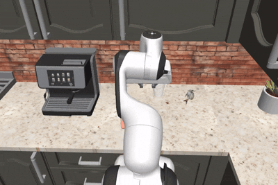

# Project Progress & Experimental Results

This section documents the chronological development and evaluation of the Cabinet Door Opening policy, moving from basic MLP models to advanced Diffusion-based imitation learning.
The goal of this project is to train a control policy for a PandaOmron mobile manipulator to autonomously open cabinet doors in various kitchen environments. This task requires the robot to coordinate its wheeled base and 7-DOF arm to approach a closed HingeCabinet, grasp the handle, and pull the door open completely.

---

## 1. Baseline: MLP Policy (Without Augmentation)
Initially, I established a baseline using standard Behavior Cloning (BC) on the original dataset.

* **Implementation**: `06_train_policy_without_augmented_data.py`
    * Trained a simple Multi-Layer Perceptron (MLP) on low-dimensional state-action pairs.
    * Applied **Action Chunking** to improve temporal coherence.
* **Observation (`08_visualize_policy_rollout.py`)**:
    * The robot exhibited **"Erratic Spinning"** behavior.
    * It continuously twisted its torso and rotated in place, without any attempt to move toward the cabinet.
* **DAgger Attempt**: Used `03_teleop_collect_demos.py` for online corrections, but the spinning behavior persisted.
* **Success Rate (`07_evaluate_policy.py`)**: **0%**

---

## 2. Improved MLP: With Data Augmentation
To address the "reachability" issue, I introduced targeted handle features and augmented data.

* **Data Augmentation (`05b_augment_handle_data.py`)**:
    * Extracted key features: `handle_pos`, `handle_to_eef_pos`, and `door_openness`.
* **Training (`06_train_policy.py`)**:
    * Retrained the MLP model using this augmented dataset with explicit target coordinates.
* **Observation**:
    * Despite the more descriptive features, the robot remained stuck in **"Spinning Loops."**
    * The model failed to translate the target information into a successful approach trajectory.
* **Success Rate (`07_evaluate_policy.py`)**: **0%**

The MLP policy (without augmentation) yielded results exactly identical to the above.

---

## 3. Advanced Policy: 1D U-Net Diffusion
To overcome the multimodality issues of MSE-based regression, I implemented a Diffusion Policy.

* **Implementation**: `09_train_lowdim_unet.py`
    * **Architecture**: Uses a **Conditional 1D U-Net** to predict noise in action chunks.
    * **Inference**: Employs a **DDPM Scheduler** for iterative denoising.
* **Observation (`11_visualize_diffusion_policy_rollout.py`)**:
    * **Initial Behavior**: Unlike the MLP, the robot **appeared to show an intent** to move toward the cabinet handle during the very early stages of the rollout.
    * **Failure Point**: However, after this initial movement, the robot did not reach the handle and instead headed toward a different direction, failing to coordinate the final grasp.
* **Evaluation (`10_eval_diffusion.py`)**: Success rate remained at **0%**.

The robot **appeared to show an intent** to move toward the cabinet handle during the very early stages of the rollout. The Diffusion policy (with DAgger) yielded results exactly identical to the above.

---

## 4. Diffusion DAgger & Hardware Constraints
I attempted to refine the Diffusion Policy using `12_diffusion_DAgger.py`, but encountered significant limitations.

* **Computational Latency**: The iterative denoising process of the Diffusion model caused **severe lag** on the local hardware.
* **Intervention Strategy**: Due to this lag, real-time switching between the model and the human was impossible. I implemented a **"Permanent Human Override"**—once the human intervenes, they take full control for the remainder of the episode.
* **Critical Analysis of Failure**:
    * **Methodological Limitation**: While the permanent override ensured continuous trajectories despite the lag, it may have hindered the DAgger process. By preventing the model from regaining control after a correction, the policy lost the opportunity to learn from its own recovered states.
* **Final Success Rate (`10_eval_diffusion.py`)**: **0%**

---

## 5. Overfitting and Validation Check
I attempted to replicate the logic from the official repo for the Diffusion model with 1D Unet, with additional statistics in order to have a check against a validation dataset.

* **Results**: The validation loss declined early in the training.

%20and%20Validation%20Loss%20(val)%20~16M%20Params%20Weight-Decay%201e-6.png)

Note that this model is eh_09. In order to run evaluation, use the eh_07 and eh_08 scripts. Warning that eh_07 is set to save a checkpoint at every epoch.

---

## Final Analysis Summary

| Experiment Phase | Policy Model | Observed Behavior | Primary Failure Reason |
| :--- | :--- | :--- | :--- |
| **Step 1: Baseline** | MLP | Erratic spinning/twisting | Compounding errors in simple BC. MSE & Multimodality|
| **Step 2: Augmented** | MLP | Erratic spinning/twisting | Compounding errors in simple BC. MSE & Multimodality|
| **Step 3: Diffusion** | **1D U-Net** | **Initial move toward handle** | **Trajectory Drift, Compounding errors, Hardware lag & DAgger constraints.** |

**Conclusion**: The Diffusion Policy showed the most promise by initiating a move toward the target. However, achieving a non-zero success rate was prevented by severe hardware lag and the limitations of the "Permanent Human Override" strategy, which likely degraded the effectiveness of the DAgger training.

Demo video: https://www.youtube.com/watch?v=UXVVj-FhfWs
